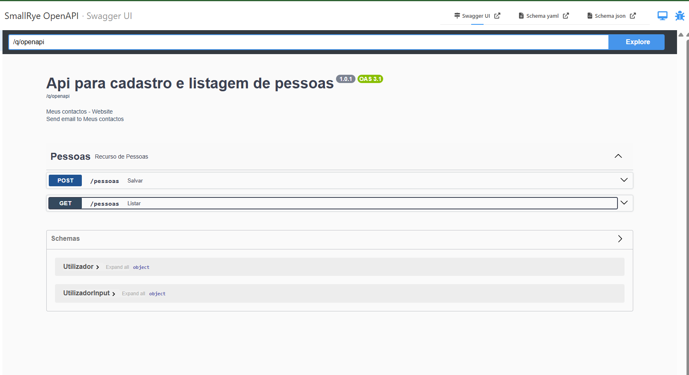
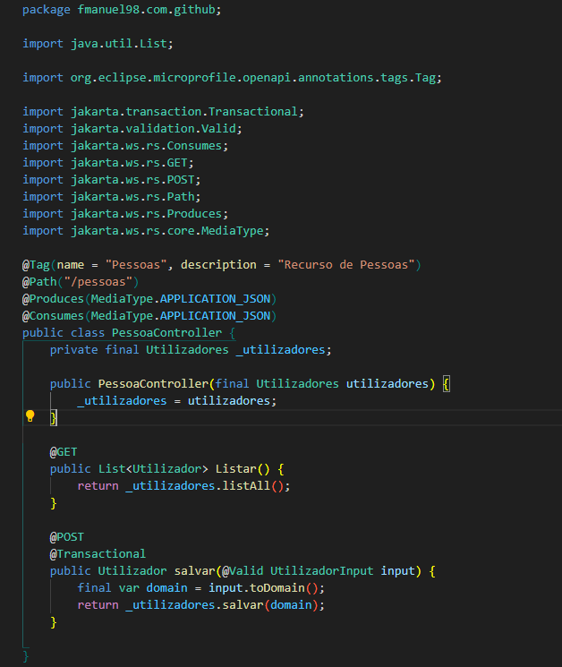

# test-quarkus

Projecto uitilizado pratico e simples para colocar em pratica conhecimentos com quarkus


## imagem da api



## Para rodar o app em dev mode

```shell script
./mvnw quarkus:dev
```

> **_NOTA:_**  acesse a dev ui no seguinte endereço <http://localhost:8080/q/dev/>.

## Tecnologias usadas

- REST JSON-B: Para sereialição de objectos. 
- JDBC Driver - H2: banco de dados em memoria
- Hibernate Validator: para validar os dtos
- Hibernate ORM with Panache : Orm nativo do quarkis
